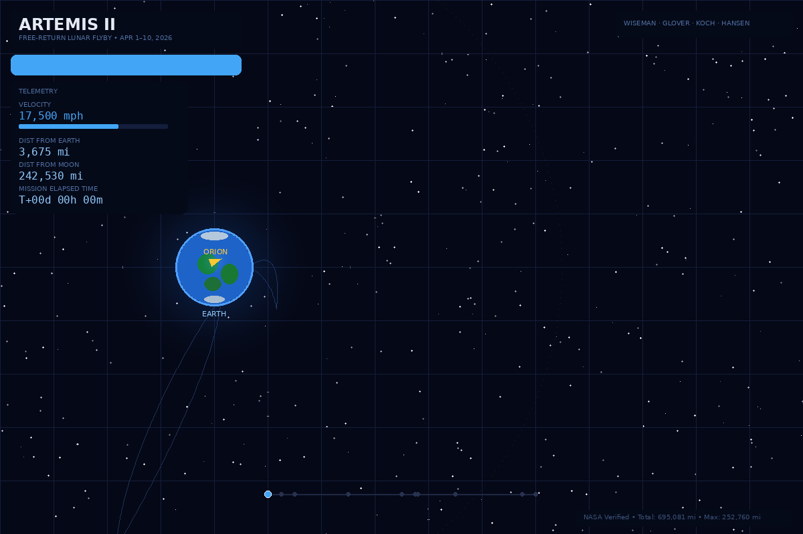

# Artemis II — 3D Free-Return Trajectory Visualization

An interactive 3D visualization of NASA's Artemis II free-return lunar flyby trajectory, built with Three.js and verified against official NASA mission data from the April 1–10, 2026 mission.

🔗 **[Live Demo →](https://geonet-myanmar.github.io/artemis2-trajectory/)**



---

## About the Mission

Artemis II is the first crewed mission of NASA's Artemis program and the first crewed flight beyond low Earth orbit since Apollo 17 in December 1972. Four astronauts — Commander Reid Wiseman, Pilot Victor Glover, Mission Specialist Christina Koch (all NASA), and Mission Specialist Jeremy Hansen (Canadian Space Agency) — launched aboard the Orion spacecraft *Integrity* on April 1, 2026, at 6:35 PM EDT from Kennedy Space Center Launch Pad 39B.

The spacecraft follows a figure-eight free-return trajectory: departing Earth orbit via a translunar injection burn, coasting four days to the Moon, performing a close flyby of the lunar far side, and returning to Earth over the following four days — all without requiring a major engine firing after TLI. Splashdown is planned for approximately April 10 in the Pacific Ocean off San Diego.

## Key Mission Data

All figures below are sourced from NASA.gov, the Canadian Space Agency, and confirmed during the ongoing mission.

| Parameter | Value |
|---|---|
| **Launch** | April 1, 2026, 6:35:12 PM EDT (22:35:12 UTC) |
| **Launch site** | KSC Launch Complex 39B, Florida |
| **Vehicle** | SLS Block 1 + Orion (ESM by ESA) |
| **Spacecraft name** | *Integrity* |
| **Total distance** | 695,081 miles (1,118,740 km) |
| **Max distance from Earth** | 252,760 miles (406,711 km) |
| **Apollo 13 record exceeded by** | ~4,105 miles (6,607 km) |
| **Closest lunar approach** | 4,070 miles (6,551 km) above surface |
| **TLI burn** | April 2, 7:49 PM EDT — 5 min 49 sec |
| **TLI escape velocity** | 24,500 mph (39,429 km/h) |
| **Lunar flyby observation window** | April 6, 2:45–9:40 PM EDT (~7 hours) |
| **Comms blackout (far side)** | ~40 minutes starting ~5:47 PM EDT April 6 |
| **Reentry speed** | ~25,000 mph (40,234 km/h) |
| **Heat shield temperature** | Up to 5,000 °F (2,760 °C) |
| **Splashdown** | ~April 10, Pacific Ocean off San Diego |
| **Mission duration** | ~10 days |

## Mission Phases

The visualization tracks ten distinct phases, each corresponding to a segment of the trajectory:

1. **Launch & Ascent** — SLS generates 8.8 million lbs of thrust. Core stage separates at T+8 min. ICPS delivers Orion to an initial 115 × 1,400 mi orbit.
2. **High Earth Orbit** — Elliptical orbit (1,500 × 46,000 mi, ~24-hour period). Crew tests life support systems and performs proximity operations demo with the spent ICPS.
3. **TLI Burn** — European Service Module engine fires for 5 min 49 sec, adding 867 mph to reach 24,500 mph escape velocity. Free-return trajectory is set.
4. **Translunar Coast** — Four-day cruise toward the Moon. One of three planned trajectory correction burns executed (17.5-sec burn on Day 5). Deep Space Network communications.
5. **Lunar Sphere of Influence** — Orion enters the Moon's gravitational sphere of influence; lunar gravity becomes the dominant force shaping the trajectory.
6. **Lunar Flyby** — Closest approach at 4,070 mi above the surface (7:02 PM EDT). Seven-hour observation window. Solar eclipse visible to crew. Communications blackout for ~40 min behind the far side.
7. **Distance Record** — Maximum distance of 252,760 mi from Earth at 7:05 PM EDT, surpassing Apollo 13's 248,655 mi record by ~4,105 mi.
8. **Return Coast** — Free-return trajectory: Earth's gravity pulls Orion home naturally. Three return trajectory correction burns. Radiation shelter construction demo on Day 8.
9. **Reentry** — Service module jettison. Atmospheric entry at ~25,000 mph. Heat shield temperatures reach up to 5,000 °F. Skip reentry maneuver.
10. **Splashdown** — Drogue parachutes deploy, followed by three main parachutes. Touchdown at ~17 mph in the Pacific Ocean off San Diego, California.

## Features

- **Real-time 3D rendering** — Three.js scene with procedural Earth (continents, atmosphere, city lights), textured Moon (craters, maria), and 6,000-star background with twinkling shader
- **Accurate trajectory** — Figure-eight free-return path computed via Bézier curves matching NASA's described flight profile, including the HEO spiral, outbound coast, far-side flyby loop, and return arc
- **Live telemetry HUD** — Velocity (mph), distance from Earth and Moon (mi), and Mission Elapsed Time, all updated in real time as the simulation progresses
- **Mission phase tracking** — Ten labeled phases displayed on an interactive timeline; click any phase to jump to that point in the mission
- **Phase detail panel** — Current phase name, color-coded indicator, and description with key statistics
- **Crew identification** — Wiseman, Glover, Koch, and Hansen shown in the header strip
- **Simulation controls** — Play/Pause, Reset, speed multiplier (1×/5×/20×/100×), trail toggle, label toggle
- **Camera controls** — Click-drag to orbit, scroll to zoom, slow auto-rotation; touch-compatible
- **Keyboard shortcuts** — Space (pause), R (reset), 1–4 (speed)
- **Single-file deployment** — One self-contained HTML file; no build step, no server, no dependencies beyond the Three.js CDN

## Live Demo

The visualization is hosted on GitHub Pages:

**https://geonet-myanmar.github.io/artemis2-trajectory/**

Optimized for desktop (1920×1080 and above). Works on mobile with touch orbit controls, though the full telemetry panel experience is best on larger screens.

## Repository Contents

```
artemis2-trajectory/
├── index.html                 # Main 3D visualization (single-file app)
├── artemis2-trajectory.gif    # Animated GIF of the trajectory (1200×800, 192 frames)
├── README.md                  # This documentation
├── LICENSE                    # MIT License
└── CONTRIBUTING.md            # Contribution guidelines
```

## Getting Started

### View Online

Visit the [live demo](https://geonet-myanmar.github.io/artemis2-trajectory/) — no installation needed.

### Run Locally

```bash
git clone https://github.com/geonet-myanmar/artemis2-trajectory.git
cd artemis2-trajectory
```

Then open `index.html` in any modern browser. No build tools or local server required.

For a local server (optional, avoids any CORS issues with fonts):

```bash
python3 -m http.server 8000
# Open http://localhost:8000
```

### Deploy to GitHub Pages

1. Fork or clone this repository.
2. Go to **Settings → Pages** in your GitHub repository.
3. Under **Source**, select the branch (e.g., `main`) and root (`/`).
4. Click **Save**. The site will be live at `https://<username>.github.io/artemis2-trajectory/`.

## Technology

| Component | Technology |
|---|---|
| 3D engine | [Three.js r128](https://threejs.org/) via CDN |
| Shaders | Custom GLSL (Earth surface, atmosphere, Moon terrain, starfield) |
| Typography | [Outfit](https://fonts.google.com/specimen/Outfit) (UI), [DM Mono](https://fonts.google.com/specimen/DM+Mono) (telemetry) |
| Trajectory | Parametric Bézier curves calibrated to NASA mission profile |
| GIF generator | Python 3 + Pillow (see `generate_gif.py` in releases) |

## Data Sources

All mission parameters were cross-referenced against the following official sources:

- [NASA — Artemis II Mission Overview](https://www.nasa.gov/missions/artemis/artemis-ii/)
- [NASA — Artemis II FAQ (updated April 6, 2026)](https://www.nasa.gov/missions/nasa-answers-your-most-pressing-artemis-ii-questions/)
- [NASA — Artemis II Launch Day Updates](https://www.nasa.gov/blogs/missions/2026/04/01/live-artemis-ii-launch-day-updates/)
- [NASA — Artemis II Flight Day 6: Lunar Flyby Updates](https://www.nasa.gov/blogs/missions/2026/04/06/artemis-ii-flight-day-6-lunar-flyby-updates/)
- [Canadian Space Agency — In-Flight Milestones](https://www.asc-csa.gc.ca/eng/missions/artemis-ii/in-flight-milestones.asp)
- [Wikipedia — Artemis II](https://en.wikipedia.org/wiki/Artemis_II)

## Browser Compatibility

| Browser | Status |
|---|---|
| Chrome 90+ | ✅ Full support |
| Firefox 90+ | ✅ Full support |
| Safari 15+ | ✅ Full support |
| Edge 90+ | ✅ Full support |
| Mobile Chrome/Safari | ✅ Touch controls supported |

Requires WebGL 1.0 or later. Hardware-accelerated graphics recommended for smooth performance at 60 fps.

## License

This project is released under the [MIT License](LICENSE).

NASA mission data is public domain. The Artemis program name and logo are trademarks of NASA.

## Acknowledgments

- **NASA** and the **Artemis II flight control team** at Johnson Space Center for making mission data publicly available in real time
- **Canadian Space Agency** for detailed in-flight milestone documentation
- **European Space Agency** for the Orion European Service Module
- The **Artemis II crew** — Reid Wiseman, Victor Glover, Christina Koch, and Jeremy Hansen — for carrying humanity back to the Moon

---

*Built with data from the ongoing Artemis II mission, April 2026.*
